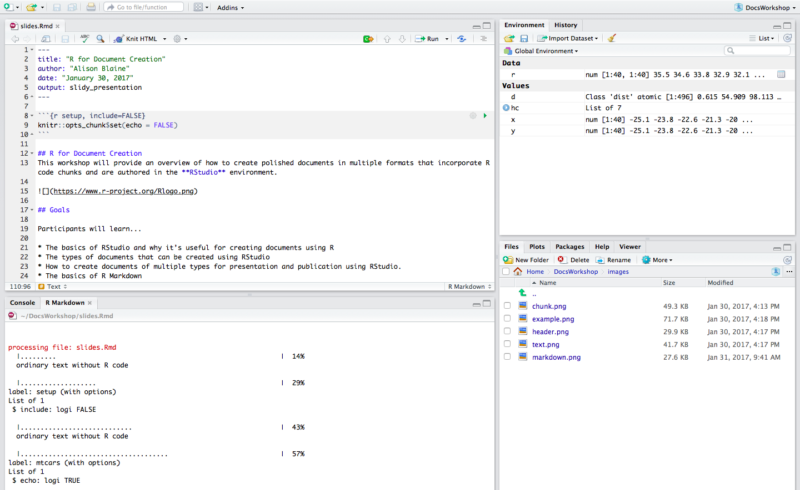

R Markdown Session Handout
================
Alison Blaine
October 24, 2017

Hands-On Session
----------------

This will be a hands-on session.

Access to RStudio server
------------------------

Make sure to get a paper slip with a URL and login information to an RStudio server instance.

**URL: check your slip**
**username: check your slip**
**password: check your slip**

About Me
--------

-   work at NCSU Libraries
-   Digital Library Initiatives: [github.com/ncsu-libraries](https://github.com/ncsu-libraries)
-   consulting, teaching & coding
-   we have lots of R Users who need to publish

Old Model of a Research Document
--------------------------------

A document and its elements as static entities:

-   document
-   figures
-   data tables
-   appendices

New Model: Dynamic Research Document
------------------------------------

-   A document where everything is contained that you need to re-run the experiment or models that produced the data. Including the code.

-   A document that is not siloed in a particular tool (Word doc) but can be easily converted to other types.

-   A document that can contain interactive visualizations and embedded apps.

-   A document that could be its own web app, github page, or slide presentation.

Wouldn't it be Cool if...
-------------------------

You could use the same open-source tool for your data cleaning, analysis and publishing?

What is R?
----------

R is a programming language for statistical computing and graphics.

-   New Zealand
-   created by statisticians named **Ross** and **Robert**
-   robust user community
-   relative obscurity in early 2000s --> top languages for data science today


R Packages
----------

Base R is extended by packages that can be imported into R. Currently there are over 13,000 registered packages. Find packages at [RDocumentation.org](http://RDocumentation.org)


R Studio
--------



What is R Markdown?
-------------------

**R Markdown** is a version of Markdown, a **text markup tool**, adapted for use in R.

R Markdown documents are fully reproducible and support dozens of static and dynamic output formats.


R Markdown Lets Us Have Nice Things
-----------------------------------


One .Rmd file --> many types of documents:

-   HTML files / websites
-   PDF
-   Microsoft Word
-   Interactive documents (Shiny apps)
-   Slide presentations
-   Books
-   Journal articles

image credit: [R Studio](http://rmarkdown.rstudio.com/)

Reproducibility
---------------

-   other people can re-run your code
-   transparency for other researchers
-   files are dynamic
-   easy to share

Versatility
-----------

In an R Markdown file, you can include:

-   HTML
-   LaTeX
-   mathjax
-   code chunks in other languages

<!-- -->

    ## R Markdown Lets Us Have Nice Things

    

    One .Rmd file --> many types of documents:

    - HTML files / websites
    - PDF
    - Microsoft Word
    - Interactive documents (Shiny apps)
    - Slide presentations
    - Books
    - Journal articles

R packages for document creation
--------------------------------

-   **pandoc** - converts documents from one markup format to another
-   **rmarkdown** - reads R Markdown. Already included with RStudio.
-   **knitr** - generates dynamic reports. Already included with RStudio.
-   **LaTeX (for PDFs)** - for Typesetting, useful for math notation and journal article formatting
-   **bookdown** - if you want to write books

[More information](http://stackoverflow.com/questions/40563479/relationship-between-r-markdown-knitr-pandoc-and-bookdown) about how these packages work together

How it works
------------

An R Markdown file (.Rmd) is the file that you will use to create your document.

A typical file has three components:

-   header
-   code chunks
-   text

Header
------

    ---
    title: "R Markdown for Publishing Documents"
    author: "Alison Blaine"
    date: "October 2017"
    output: html_document
    ---

Written in YAML, a format common for configuration files

**Output options**:

html\_document, pdf\_document, word\_document, md\_document, ioslides\_presentation, slidy\_presentation, beamer\_presentation, revealjs\_presentation (revealjs package must be installed)

Header Options: CSS
-------------------

-   You can add a [CSS (Cascading Style Sheet)](https://en.wikipedia.org/wiki/Cascading_Style_Sheets) file to your project if you want to change the styling of your document.
-   The CSS file must be included in your project directory and named in the header.

<!-- -->

     ---
     title: "R Markdown for Publishing Documents"
     output: 
       slidy_presentation:
          css: styles.css
    ---

Header Options: Table of Contents
---------------------------------

    ---
    title: "R Markdown for Publishing Documents"
    output:
      html_document:
        toc: true
        toc_float: true
        number_sections: true
    ---

Header for this Presentation
----------------------------

    ---
    title: "R Markdown for Publishing Documents"
    author: "Alison Blaine"
    date: "NCSU Libraries"
    output: 
      revealjs::revealjs_presentation:
        theme: blood
        highlight: zenburn
        transition: slide
    ---

Code chunks
-----------

Make a code chunk with 3 backticks then {r}. End chunk with 3 backticks:


Example
-------

``` r
attach(mtcars)
plot(wt, mpg, main="Scatterplot Example",
    xlab="Car Weight ", ylab="Miles Per Gallon ", pch=19)  
```


Chunk options
-------------

Using chunk options, you can set rules for your code chunks.

-   to specify the dimensions of a figure
-   to make it so a code chunk does not appear in the final document
-   to show or hide the code in the code chunk
-   to display or not display error messages generated by the code

`{r echo=TRUE, eval=FALSE}`

Example 1
---------

`{r echo=TRUE}`

``` r
plot(wt, mpg, main="Scatterplot Example",
    xlab="Car Weight ", ylab="Miles Per Gallon ", pch=19)  
```


Example 2
---------

`{r echo=FALSE}`


Global Chunk Options
--------------------

These provide rules for all of the chunks in the document.

Example: `knitr::opts_chunk$set(echo = FALSE)`


Text
----

Formatting text requires R Markdown notation. See R Markdown Reference Guide for more examples.


normal text
*italics*
**bold**
[hyperlink example](http://www.ncsu.edu)

Rendering Your R Markdown File
------------------------------

Save your .Rmd file, and click the *"Knit"* button that appears above the file.

You can set certain output options by clicking on the gear icon next to the Knit button.


Templates
---------

There are existing R Markdown templates for html files, slide shows, and scholarly journal article formats.

-   github document
-   Package Vignette (HTML)
-   [tufte](http://rstudio.github.io/tufte/) is a template for handouts in the style of Edward Tufte.
-   [rticles](https://github.com/rstudio/rticles) is a LaTeX academic journal R package.

To use a template, you can install a template package or download it from the source:

install.packages("rticles", type = "source")

Opening a Template from Installed Package in RStudio
----------------------------------------------------

After installing the rticles package:

1.  File &gt; New File &gt; R Markdown...
2.  Select "From Template"

The window should populate with templates from the rticles package

Note: a *full installation of LaTeX is required* for this to work.

Hands-On Part Begins
--------------------


Log in to R Studio
------------------

Use the paper slip on to log in to RStudio:

### **URL: check your slip**

#### **username: check your slip**

#### **password: check your slip**

Open the Cheatsheet
-------------------

In RStudio, go to `Help > Cheatsheets > R Markdown Reference Guide`

Exercise 1: Create an R Markdown file
-------------------------------------

1.  **Log in to RStudio at go.ncsu.edu/ato** (or open RStudio on your computer)
2.  File &gt; New File &gt; R Markdown
3.  Select HTML
4.  Title it "HelloWorld"
5.  Click the save button. Save as "HelloWorld"
6.  Click "Knit Html" to see it render as an HTML file

Change Your Global Chunk Option
-------------------------------

Try setting your global chunk option to the following. Each time, knit the code to see changes.

`knitr::opts_chunk$set(echo = FALSE)`

`knitr::opts_chunk$set(eval = FALSE)`

Knit as an Open Office or PDF Doc
---------------------------------

Change `output: html_document` to `output: odt_document` or `output: pdf_document`.

    ---
    title: "Hello World"
    author: "Alison Blaine"
    date: "10/11/2017"
    output: pdf_document
    ---

Exercise 2: Open Nile.Rmd file
------------------------------


Overview of Nile.Rmd
--------------------

This document is about the annual flow (in *m*<sup>3</sup>) of the Nile River at Aswan from 1871–1970.

Inside your code chunk should be two commands:

``` r
library(MASS)
summary(Nile)
```

`library(MASS)` - loads the MASS library of sample datasets
`summary(Nile)` - shows the statistical summary of the data set

Add a plot
----------

Skip a line and then **create a new R code chunk** under the previous one. Add a plot inside the chunk with the following command:

    plot(Nile)


Title the Plot
--------------

`## Flow Over Time`


Resize the plot by adding a chunk option
----------------------------------------

Knit when you're finished!

 

Create a new section
--------------------

    ## Distribution

Add a Histogram
---------------

``` r
hist(Nile)
```


Add a Floating Table of Contents
--------------------------------

    ---
    title: "Measuring Nile Flow"
    author: "Your Name Here"
    date: "October 24, 2017"
    output: 
        html_document: 
          toc: true
          toc_float: true
    ---

Convert Your Document into a Slide Presentation
-----------------------------------------------

Pandoc will allow you to convert your html file into a slide presentation.

    ---
    title: "Measuring Nile Flow"
    author: "Your Name Here"
    date: "October 24, 2017"
    output: ioslides_presentation
    ---

Including Shiny in R Markdown
-----------------------------

-   Shiny is an R framework for creating interactive web applications.
-   Shiny widgets and apps can be embedded into an R markdown file, or exist as stand-alone applications.
-   Lots of tutorials exist for creating Shiny applications or Shiny widgets embedded in R Markdown documents.

Here are some good ones:

-   [Shiny R Studio tutorial](https://shiny.rstudio.com/articles/interactive-docs.html)
-   [How to Build a Shiny App](http://shiny.rstudio.com/tutorial/)

Exercise 3: Open Shiny\_Nile.Rmd
--------------------------------

File &gt; New File &gt; R Markdown &gt; Shiny &gt; Shiny Document

`output: html_document`
`runtime: shiny`

Shiny documents have "Run Document" buttons. Click this to render the document.

When you save the file, you'll notice that the "Run Document" button appears

Shiny Code Chunk
----------------

After the line plot code, the highlighted code chunk to create an interactive histogram.

``` r
# create dropdown selector for histogram
inputPanel(
  selectInput("n_breaks", label= "Bins", c(10, 20, 30, 40), selected = 10)  #creates a dropdown selector
)

# create histogram
renderPlot({
hist(Nile, xlab= "Measurement", probability = TRUE, breaks = as.numeric(input$n_breaks), col="deepskyblue3") 
})
```

Run the document. The histogram will update when a new value is selected from the dropdown menu.

Creating a Static Site
----------------------

To create a static website with R Markdown, you need the following files:

-   \_site.yml
-   an .Rmd file for every page


Rendering Your Website
----------------------

Inside directory that contains \_site.yml and index.Rmd, you can run:

`rmarkdown::render_site()`

Exercise 4: Open \_site.yml file
--------------------------------

Add resume.html

    ---
    name: "my-website"
    navbar:
      title: "My Website"
      left:
        - text: "Home"
          href: index.html
        - text: "About Me"
          href: about.html
        - text: "Resume"
          href: resume.html
    ---

Create resume.html .Rmd file
----------------------------

    ---
    Your Name   
    Address  
    Contact Info  
    <hr>

    ##### Education

    ##### Work Experience 
    ---

Render the site
---------------

Make sure you're in the website directory

Type `rmarkdown::render_site()` in the console


